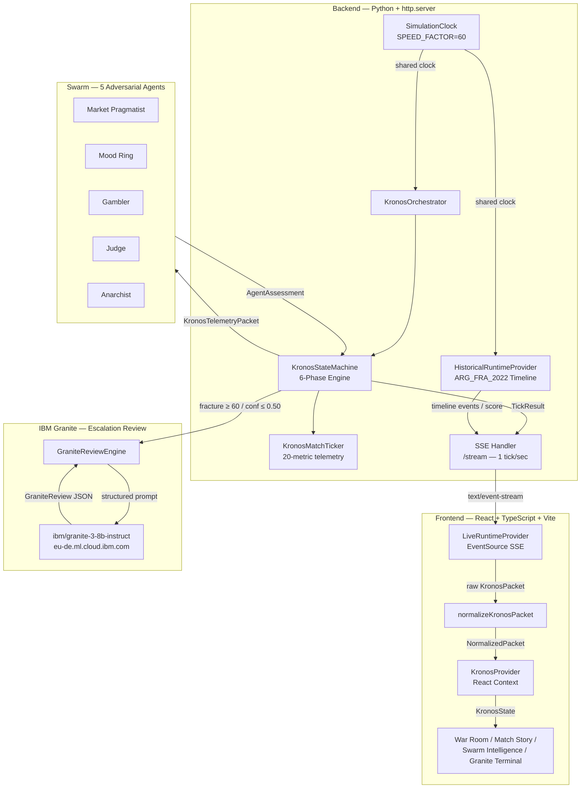
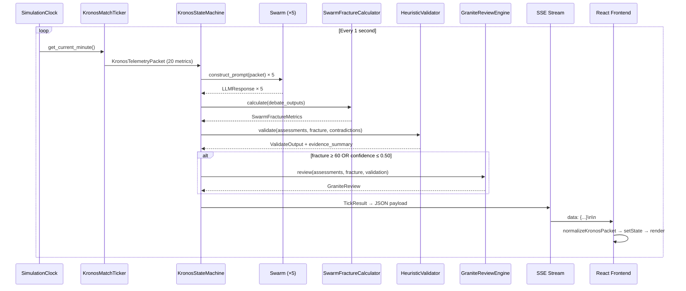
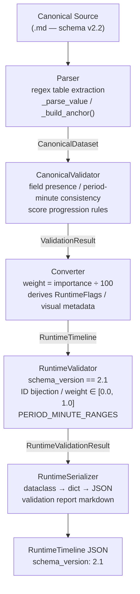
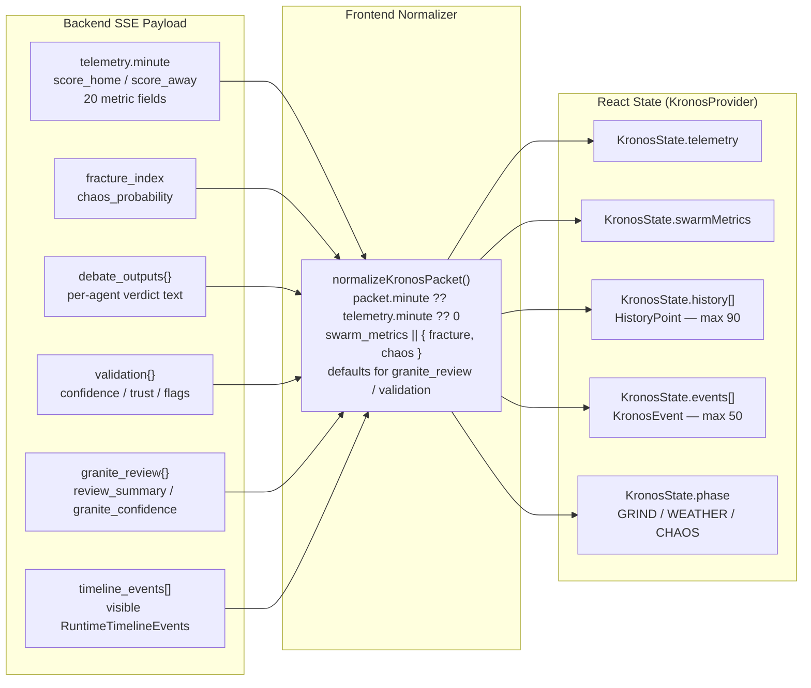

```mermaid
graph LR
    A["Historical Reports<br/>(Canonical Markdown Sources)"]
    B["Parser<br/>parse_dataset()"]
    C["CanonicalDataset<br/>CanonicalAnchor[]"]
    D["Validator<br/>validate_dataset()"]
    E["Converter<br/>Converter.convert()"]
    F["RuntimeValidator<br/>validate_runtime()"]
    G["RuntimeSerializer<br/>serialize() / write_json()"]
    H["Runtime Timeline JSON<br/>argentina_france_2022_timeline.json"]
    I["HistoricalRuntimeProvider<br/>loads once at startup"]
    J["SSE Event Stream<br/>progressive event unlock"]

    A --> B --> C --> D --> E --> F --> G --> H --> I --> J
```

# Kronos — Explainable Football Intelligence Operating System


> **An adversarial swarm intelligence engine for football match analysis, powered by IBM Granite — built for explainability from the ground up.**

Kronos is not a score predictor. It is a structured reasoning operating system that applies five competing AI agents — each with a distinct analytical lens — to live and historical football data, quantifies how much they disagree, and produces a graded, evidence-backed verdict. Every conclusion traces to a specific agent, a specific telemetry signal, and a specific moment in the match. When the swarm fractures badly enough, IBM Granite intervenes with an independent review.

The system was designed with one principle above all others: **no output should be unexplainable**.

---

## The Problem

Football analytics has a credibility problem.

Commercial prediction models output probabilities with no reasoning attached. Black-box neural networks produce confident results without disclosing which signals drove them. Tactical analysis tools operate in isolation — physical data in one silo, psychological signals in another, environmental conditions ignored entirely. Most live match intelligence systems present a single number with no indication of uncertainty.

Four specific failure modes characterise current approaches:

**Unexplainable outputs.** A model that says "72% chance of home win" without identifying the underlying signals is not intelligence — it is an opinion disguised as precision. When the prediction is wrong, there is no path back to a cause.

**Single-perspective reasoning.** Aggregating agent verdicts into a single model means minority signals are suppressed. Genuine risk is often found in disagreement, not consensus. A system that smooths over contradictions destroys the most valuable information it has.

**Fragmented context.** Tactical metrics, physical fatigue, psychological pressure, environmental conditions, and game-theory behaviour all affect match outcomes simultaneously. Tools that analyse these dimensions independently miss the cross-domain causal links between them.

**No quantified uncertainty.** Stating a prediction without quantifying how much the model's own components disagree is misleading. High confidence derived from unanimous agreement means something fundamentally different from high confidence derived from a fractured swarm.

---

## The Solution

Kronos is an **Explainable Football Intelligence Operating System** built around four architectural commitments.

**Adversarial swarm intelligence.** Five agents — the Market Pragmatist, Mood Ring, Gambler, Judge, and Anarchist — each analyse different dimensions of the same telemetry packet independently and produce verdicts with confidence scores and rationale. The system then measures how much they disagree. That disagreement is not noise to be averaged away; it is the primary output signal.

**Deterministic runtime architecture.** Every telemetry packet, every agent assessment, every swarm metric, every historical timeline event is generated deterministically from the same clock state. The `SimulationClock` is the single authoritative time source. All components share one instance. There is no clock drift, no race condition, no cached stale minute.

**Built-in explainability.** Every verdict references the specific agents that drove it, the specific telemetry signals that triggered those agents, the specific fracture threshold that was crossed, and the specific validation flags that fired. The `HeuristicValidator` computes an evidence summary in prose. The `GraniteReviewEngine` generates structured contradiction analysis. Nothing is silent.

**Historical and live intelligence on the same runtime.** The same `RuntimeProvider` interface powers both a compiled historical match timeline (Argentina vs France, 2022 FIFA World Cup Final) and a live match engine. Switching providers requires no application changes.

---

## Key Features

### Adversarial Swarm Intelligence
Five agents each own a distinct analytical lens. The **Market Pragmatist** reads score differentials and pressing efficiency. The **Mood Ring** quantifies psychological fragility via crowd noise, panic index, and foul escalation. The **Gambler** identifies high-variance game-theory scenarios from substitution shock and rest-defense collapse. The **Judge** predicts red-card probability from discipline escalation. The **Anarchist** measures environmental friction degradation from pitch slickness, wind, and fog. They do not collaborate — they compete. Their disagreement is the most important signal the system produces.

### Swarm Fracture Quantification
The `SwarmFractureCalculator` classifies each agent's output into prediction categories, computes an agreement score (max_count / total × 100), derives a fracture index (100 − agreement), and calculates chaos probability by applying high-risk agent bonuses. The result is a precise, reproducible measure of swarm coherence, emitted every tick.

### IBM Granite Integration
When the swarm fractures above threshold (`fracture_index ≥ 60`), confidence falls below threshold (`overall_confidence ≤ 0.50`), or contradictions are detected, the `GraniteReviewEngine` escalates to IBM Granite (`ibm/granite-3-8b-instruct`). Granite receives a structured prompt containing the full validation state, swarm metrics, and per-agent assessments. It returns a structured JSON response: `review_summary`, `contradiction_analysis`, `confidence_assessment`, `recommended_action`, and a `granite_confidence` score (0–100).

### Evidence-Backed Reasoning
The `HeuristicValidator` scores every tick across three dimensions: agreement (35%), trust (40%), fracture inverse (25%). It fires five typed `ValidationFlag` values — `LOW_CONFIDENCE`, `HIGH_FRACTURE`, `NO_CONSENSUS`, `CONTRADICTORY_VERDICTS`, `AGENT_FAILURE` — and generates a human-readable `evidence_summary` string that appears in the UI without further processing.

### Historical Match Intelligence Pipeline
Raw football match narrative (markdown canonical source documents) flows through a five-stage compiler: parse → validate → convert → runtime-validate → serialize. Each stage has its own exception type, result model, and issue list. The output is a `RuntimeTimeline` JSON document that can be replayed by any `RuntimeProvider`. The pipeline currently ships with the 2022 FIFA World Cup Final (Argentina 3–3 France, including penalty shootout).

### Timeline Compiler
A deterministic, schema-versioned compilation pipeline (`TimelineCompiler v1.0.0`) transforms canonical markdown anchor documents into runtime-ready JSON. Every event has a stable `event_id` with a canonical naming convention (`ARG_FRA_2022_023_GOAL`), a deterministic visual metadata set (icon, color hex, animation trigger, audio trigger), and a set of `RuntimeFlags` computed from event type and importance weight. One-to-one traceability between source document and compiled output is enforced by the `RuntimeValidator`.

### Unified Runtime Event Model
`RuntimeTimelineEvent` carries the complete information needed for UI rendering: match timing, score state, visual metadata, confidence level, attribution references, and `RuntimeFlags` (`is_key_event`, `is_highlight`, `is_commentary_trigger`, `show_on_timeline`, `include_in_replay`, `requires_user_attention`). No downstream component needs to interpret raw event data.

### Continuous Historical Simulation
The `SimulationClock` runs a looping 180-minute simulation (`SPEED_FACTOR = 60`: one match-minute per real second). The `HistoricalRuntimeProvider` uses the clock position to unlock timeline events progressively: events with `minute ≤ current_minute` become visible. Score, statistics, and phase all derive from this same clock position. The loop resets automatically at 180 minutes.

### Live Match Intelligence
The `KronosMatchTicker` generates a full `KronosTelemetryPacket` every tick with 20 metrics across five domains (tactical, physical, psychological, game-theory, environmental), driven by a four-phase narrative engine: Warm-up (1–15), The Grind (16–60), The Turning Point (61–75, rain arrives), and Chaos (76+, scripted triggers fire). Cross-domain causal links are enforced: `pitch_slickness > 0.8` forces `gk_sweeper_dist ≥ 22m`; `panic_index > 0.8` forces `vertical_disconnect ≥ 15m`.

### Explainable Recommendations
Every `RecommendOutput` carries an `urgency` classification (`STABLE` / `WATCH` / `CRITICAL`), a full per-agent `AgentAssessment` set with `verdict`, `confidence`, `risk_level`, `rationale`, and `supporting_signals`, plus the complete `ValidateOutput` and `GraniteReview`. The frontend `verdictEngine` derives a `LeadCoachVerdict` with `status`, `headline`, `rationale`, and typed `SupportingSignal` list from these fields — no heuristics applied in the UI layer.

### Dual-Mode Runtime (Historical / Live)
`RuntimeProvider` is a three-method TypeScript interface (`start`, `stop`, `subscribe`). `LiveRuntimeProvider` implements it against the backend SSE stream. The historical provider is implemented in Python on the backend and drives the same SSE stream with compiled timeline data. Switching between modes requires no frontend changes.

---

## Architecture

### Overall Platform Architecture



---

### Historical Match Intelligence Pipeline



---

### Live Intelligence Pipeline



---

### Timeline Compiler



---

### Runtime Event Flow



---

## Historical Match Intelligence Pipeline

### Why the pipeline exists

Match intelligence is only as good as the evidence it runs on. Raw football match data is unstructured, inconsistent, and full of ambiguity — minute values clash across sources, goals are attributed differently, stoppage time is recorded inconsistently. Importing this data directly into a runtime engine propagates all those defects into every downstream decision.

The Historical Match Intelligence Pipeline solves this by introducing a **canonical intermediate representation**: a human-authored, peer-reviewed markdown document that encodes each match event as a structured anchor with explicit field validation rules. The markdown format is intentional — it allows a human analyst to read, edit, and reason about the dataset without specialised tooling. The compiler then transforms it mechanically into a runtime-ready JSON document.

This is one of Kronos's most significant engineering differentiators. Most football intelligence systems couple their data format directly to their runtime. Kronos separates the two with a typed, validated, versioned schema (`v2.2`) and a stateless compilation step that can be re-run at any time. The output is reproducible. The chain of evidence is complete.

### Pipeline Stages

**Historical Reports → Evidence Harvest**
Five canonical source documents covering the 2022 FIFA World Cup Final are the authoritative human record. Each part is written against the `v2.2` schema, which specifies exact field types, allowed enum values, period-minute consistency rules, and score progression constraints.

**Raw Event Harvest → Candidate Inventory**
Events are extracted from the source documents and catalogued as candidate anchors. Each anchor records: `event_id` (stable, convention-based), `minute`, `stoppage_time`, `match_period`, `event_type`, `importance` (0–100), `score_after_event`, `source_confidence`, `narrative_notes`, and `source_references`.

**Candidate Inventory → Canonical Dataset**
The `Parser` loads the markdown file and constructs a `CanonicalDataset` containing a `DatasetMetadata` block and a list of `CanonicalAnchor` objects. The `CanonicalValidator` then enforces: required field presence, unique `event_id` values, period-minute range consistency, importance bounds, chronological ordering, and score progression rules for `GOAL` events (exactly +1 to one side per goal, no simultaneous increments).

**Canonical Dataset → Runtime Timeline**
The `Converter` transforms each `CanonicalAnchor` into a `RuntimeTimelineEvent` by: computing `weight = importance / 100.0`, deriving `visible` from a heuristic (always visible: GOAL/PENALTY/CARD/SUBSTITUTION; hidden: importance ≤ 9 or low-weight PHASE_CHANGE), computing `RuntimeFlags` from event type and weight, and assigning visual metadata (icon, color hex, CSS animation class, audio trigger) per event type. The full visual metadata table is encoded in the converter — no runtime component needs to know how a goal should look.

**Runtime Timeline → Historical Runtime Provider**
The `RuntimeSerializer` writes the compiled timeline to `argentina_france_2022_timeline.json`. The `HistoricalRuntimeProvider` loads this file once at startup. From that point, all runtime queries are in-memory: `get_visible_events()` filters by `event.minute ≤ current_minute`, `get_current_score()` walks the visible event list for the most recent score entry, and `get_current_statistics()` aggregates event type counts.

**Historical Runtime Provider → Runtime Event Stream**
The `app_server.py` SSE handler calls `historical_provider.get_visible_events()` on every tick and includes the result in the SSE payload under `timeline_events`. The frontend receives progressively unlocked timeline events in real time, synchronized with the simulation clock.

---

## Timeline Compiler

The `TimelineCompiler` (`compiler.py`, version `1.0.0`) orchestrates the full compile chain:

```python
compiler = TimelineCompiler()
compiler.load("path/to/canonical_source.md")
compiler.validate()
compiler.convert()
compiler.validate_runtime()
compiler.write_json()
compiler.write_validation_report()
```

Each method is idempotent and records its result before proceeding. If any stage fails, a typed exception is raised (`ParseError`, `ValidationError`, `FileFormatError`, `CompilerError`) with the exact issue list.

### Parser
Regex-based markdown table extraction. Splits the source document by `## Part` sections and `### Event — {TYPE}` headers. Parses markdown tables into field dictionaries using `_parse_value()`, which handles JSON literals wrapped in backticks. Constructs `CanonicalAnchor` objects and enforces `event_id` uniqueness at parse time.

### Validator
`validate_dataset()` checks all `CanonicalAnchor` objects against the schema rules: required fields, allowed enum values for `event_type` and `match_period`, period-minute range consistency, `importance` in [0, 100], chronological ordering by `(minute, stoppage_time)`, and score progression integrity for `GOAL` events.

### Converter
`Converter.convert()` produces a `RuntimeTimeline` from a validated `CanonicalDataset`. The weight mapping (`importance / 100.0`), visibility heuristic, `RuntimeFlags` derivation, and visual metadata assignment are all deterministic and encoded as rules in the converter — not in the runtime. The compiler writes the decisions; the runtime only reads them.

### Runtime Validator
`validate_runtime()` performs a second-pass validation on the compiled `RuntimeTimeline`: schema version check (`2.1`), `match_id` format validation, ID uniqueness, `weight` precision (max 2 decimal places), `confidence` enum membership, period-minute range consistency, score progression for `GOAL` events, penalty shootout score isolation, `RuntimeFlags` field completeness (6 boolean fields required), visual metadata presence, and chronological ordering.

### Serializer
`RuntimeSerializer.serialize()` converts the `RuntimeTimeline` dataclass tree into a plain `Dict[str, Any]` using recursive `asdict()` calls. `write_json()` writes the output to the configured output directory. `generate_validation_report()` produces a full markdown report with a stage-by-stage summary table and per-issue detail listing.

### Deterministic compilation
The same source document always produces the same output. No random values, no timestamps, no environment-dependent logic. If the output JSON changes between runs, the source document changed. This property makes the compiler safe to run in CI and suitable for version-controlled output.

---

## Runtime Architecture

### SimulationClock
The single authoritative time source for the entire backend. Created once in `app_server.py` as a module-level singleton (`_shared_clock`), then injected into every component that needs match time. `get_match_time()` is a pure function of wall-clock elapsed time: `simulated_seconds = elapsed × SPEED_FACTOR`, `match_elapsed = simulated_seconds % 10800` (180 min loop), `minute = (int(match_elapsed) // 60) + 1`. With `SPEED_FACTOR = 60`, one real second advances the clock by one match minute. There are no threads, no timers, no scheduled jobs — just arithmetic on `time.time()`.

### HistoricalRuntimeProvider
Owns the `SimulationClock` reference and the loaded `RuntimeTimeline`. Exposes four query methods (`get_current_match_time`, `get_visible_events`, `get_current_score`, `get_current_statistics`) that derive their results from the clock position and the in-memory timeline. No mutable state is modified after construction. Safe to call from any handler thread.

### KronosMatchTicker
Derives `minute = self._clock.get_current_minute()` on every `generate_tick()` call. Uses the minute to select a narrative phase and generate appropriate telemetry values via seeded Gaussian distributions with phase-appropriate parameters. Maintains smoothed state variables (`_field_tilt`, `_pitch_slickness`, `_panic_index`, `_defensive_fatigue`) that accumulate across ticks to simulate realistic metric progression.

### Runtime Event Stream
The SSE handler in `app_server.py` loops at one-second intervals. Each iteration: calls `orchestrator.process_next_tick()` (runs all 6 phases), calls `_build_payload()` (flattens telemetry, injects clock-derived minute and score, appends timeline events), and writes `data: {json}\n\n` to the socket. The `minute` field is emitted at both `payload.minute` (top-level, matching `KronosPacket.minute`) and `payload.telemetry.minute` for backward compatibility.

### Provider-agnostic design
The frontend `RuntimeProvider` interface has three methods:

```typescript
interface RuntimeProvider {
  start(onStatus?: StatusListener): void;
  stop(): void;
  subscribe(listener: PacketListener): () => void;
}
```

`LiveRuntimeProvider` implements this against the backend SSE stream. Any alternative implementation (WebSocket provider, polling provider, replay provider) satisfies the same interface and requires no changes in `KronosProvider.tsx` or any page component.

---

## Explainability

Kronos treats explainability as an architectural property, not a presentation feature. Every layer in the pipeline is designed to preserve the reasoning chain from telemetry signal to final verdict.

### Agent Debate
Each agent receives the same `KronosTelemetryPacket` and independently constructs a reasoning prompt scoped to its analytical domain. The prompt is a structured natural language document that names the specific metrics it is interpreting and asks a domain-specific question. Responses are parsed deterministically: "High-risk" in the content maps to `verdict=HIGH_RISK`, `confidence=0.81`, `risk_level=HIGH`; "Nominal" maps to `verdict=NOMINAL`, `confidence=0.62`, `risk_level=LOW`; everything else is `ELEVATED_RISK`, `confidence=0.70`, `risk_level=MEDIUM`.

### Heuristic Validation
The `HeuristicValidator` scores the swarm on every tick. `agreement_score = fracture_metrics.agreement_score / 100.0`. `trust_score` is a weighted average of provider reliability coefficients (Granite: 1.0, Bob: 0.9, Mock: 0.5) and a fracture penalty. `overall_confidence = 0.35 × agreement + 0.40 × trust + 0.25 × (1 − fracture/100)`. Five flags fire on threshold crossings. The `evidence_summary` field is a prose string describing what fired and why — it reaches the UI without transformation.

### Granite Review
The `GraniteReviewEngine` escalates when any of three conditions are true: `fracture_index ≥ 60`, `overall_confidence ≤ 0.50`, `contradiction_count ≥ 1`. The escalation prompt contains the complete validation state, the full swarm metric set, and per-agent assessments including provider, rationale, and risk level. Granite returns a structured JSON response with `review_summary`, `contradiction_analysis`, `confidence_assessment`, `recommended_action`, and `granite_confidence`. These fields are passed through unchanged to the frontend.

### Evidence Traceability
The `FractureAttribution` module computes each agent's percentage contribution to the fracture score (HIGH_RISK agents receive weight 10; NOMINAL agents receive weight 1) and distributes any rounding error to the highest contributor. The `verdictEngine` generates a typed `SupportingSignal` list that links each risk indicator to its category: `AGENT` (which agent raised HIGH_RISK), `FRACTURE` (which threshold was crossed), `CHAOS` (which probability level was reached), or `TELEMETRY` (which specific metric — `panic_index ≥ 0.7`, `crowd_decibels ≥ 90`, `pitch_slickness ≥ 0.7`, `foul_escalation ≥ 5`).

---

## Technology Stack

| Layer | Technology | Purpose |
|---|---|---|
| Frontend framework | React 18.3 + TypeScript 5 | Component model, type safety |
| Build tool | Vite + SWC | Sub-second HMR, production bundling |
| Styling | Tailwind CSS | Utility-first design system |
| Charts | Recharts 3.8 | Fracture timeline, gauge bars |
| Routing | React Router 7 | Page navigation |
| State | React Context + `useState` | SSE-driven global state |
| SSE client | Browser `EventSource` | Live data stream |
| Backend runtime | Python 3.13 `http.server` | Zero-dependency SSE server |
| Orchestration | Custom 6-phase state machine | OBSERVE → RECOMMEND pipeline |
| LLM gateway | `LLMGateway` abstraction | mock / bob / hybrid / granite modes |
| IBM Granite | `ibm/granite-3-8b-instruct` | Escalation review engine |
| Granite auth | IBM Cloud IAM token service | Cached JWT with 5-min refresh window |
| Data format | Server-Sent Events | Unidirectional streaming, auto-reconnect |
| Testing | pytest 9 + `unittest` | 246 tests, 110 subtests |
| Frontend deploy | Vercel | Static SPA hosting |
| Backend deploy | Render | Python service hosting |
| Historical data | Argentina vs France, 2022 World Cup Final | 42 compiled timeline events |

---

## Repository Structure

```
kronos-swarm-core/
│
├── backend/
│   ├── app_server.py              # HTTP server, SSE handler, payload assembly
│   │
│   ├── agents/
│   │   ├── persona_builder.py     # Template-based mock response generation
│   │   └── swarm/
│   │       └── archetypes.py      # 5 agent classes: Market Pragmatist, Mood Ring,
│   │                              #   Gambler, Judge, Anarchist
│   │
│   ├── config/
│   │   └── runtime.py             # RuntimeConfig singleton; env var loading
│   │
│   ├── contracts/
│   │   ├── telemetry_dataclasses.py  # KronosTelemetryPacket + 5 metric groups
│   │   ├── swarm_metrics.py          # SwarmFractureMetrics + SwarmFractureCalculator
│   │   └── granite_review.py         # GraniteReview frozen dataclass
│   │
│   ├── llm/
│   │   ├── gateway.py             # LLMGateway: mock / bob / hybrid / granite routing
│   │   ├── contracts.py           # LLMResponse dataclass
│   │   ├── mock_provider.py       # Deterministic persona-based responses
│   │   ├── bob_provider.py        # Bob LLM provider (Bearer auth)
│   │   └── granite_provider.py    # IBM Granite provider (IAM token auth)
│   │
│   ├── match_story/
│   │   ├── compiler/
│   │   │   ├── compiler.py        # TimelineCompiler v1.0.0 — orchestrates pipeline
│   │   │   ├── models.py          # CanonicalAnchor, RuntimeTimelineEvent, enums, flags
│   │   │   ├── parser.py          # Markdown table parser → CanonicalDataset
│   │   │   ├── validator.py       # CanonicalValidator — schema + business rules
│   │   │   ├── converter.py       # Converter — weights, flags, visual metadata
│   │   │   ├── runtime_validator.py # RuntimeValidator — compiled timeline integrity
│   │   │   ├── serializer.py      # RuntimeSerializer — dataclass → JSON + reports
│   │   │   └── exceptions.py      # ParseError, ValidationError, FileFormatError
│   │   │
│   │   └── runtime/
│   │       ├── simulation_clock.py      # SimulationClock — authoritative time source
│   │       ├── virtual_clock.py         # VirtualMatchClock — non-looping variant
│   │       ├── clock_models.py          # MatchTime frozen dataclass
│   │       └── historical_runtime_provider.py  # Timeline-driven runtime queries
│   │
│   ├── orchestrator/
│   │   ├── core_supervisor.py     # KronosOrchestrator — thin wrapper
│   │   ├── state_machine.py       # KronosStateMachine — 6-phase engine
│   │   ├── validation.py          # HeuristicValidator + ValidationFlag
│   │   └── granite_review.py      # GraniteReviewEngine — escalation + prompt
│   │
│   ├── utils/
│   │   └── kronos_ticker.py       # KronosMatchTicker — 20-metric telemetry generator
│   │
│   ├── docs/
│   │   ├── architecture/          # Schema docs (v2.1, v2.2), architecture ADRs
│   │   └── datasets/
│   │       ├── canonical/         # Human-authored markdown source documents (5 parts)
│   │       └── json/
│   │           └── argentina_france_2022_timeline.json  # Compiled runtime timeline
│   │
│   └── tests/                     # pytest test suite — 246 tests
│
└── frontend/
    ├── index.html
    ├── vite.config.ts             # Vite + React, port 5173
    ├── tailwind.config.js
    │
    └── src/
        ├── main.tsx               # React entry point
        ├── App.tsx                # Router root
        │
        ├── types/
        │   └── kronos.ts          # All TypeScript interfaces and enums
        │
        ├── context/
        │   └── KronosProvider.tsx # SSE → normalize → React context state
        │
        ├── runtime/
        │   ├── RuntimeProvider.ts     # Interface: start / stop / subscribe
        │   └── LiveRuntimeProvider.ts # EventSource SSE implementation
        │
        ├── lib/
        │   ├── normalizeKronosPacket.ts  # Raw SSE packet → NormalizedPacket
        │   ├── eventEngine.ts            # Threshold-crossing event generation
        │   ├── swarmNormalizer.ts        # Agent verdict → SwarmAgent[]
        │   ├── verdictEngine.ts          # LeadCoachVerdict derivation
        │   ├── fractureAttribution.ts    # Per-agent fracture contribution %
        │   ├── swarmCohesion.ts          # Cohesion status: COHESIVE/FRACTURED/COLLAPSED
        │   └── telemetryGroups.ts        # Metric group definitions
        │
        ├── hooks/
        │   └── useKronos.ts       # useContext wrapper, throws if outside provider
        │
        ├── components/
        │   ├── charts/
        │   │   └── FractureTimeline.tsx  # Recharts LineChart: fracture + chaos vs minute
        │   ├── layout/
        │   │   ├── CommandHeader.tsx     # Global nav + live status bar
        │   │   ├── TelemetryPanel.tsx    # Grouped collapsible metric display
        │   │   ├── SwarmPanel.tsx        # Agent overview cards
        │   │   └── EventFeed.tsx         # Real-time event log
        │   ├── swarm/
        │   │   └── AgentIntelligenceCard.tsx
        │   ├── validation/
        │   │   └── ValidationCenter.tsx
        │   ├── verdict/
        │   │   └── LeadCoachVerdictPanel.tsx
        │   └── granite/
        │       └── GraniteTerminal.tsx
        │
        └── pages/
            ├── WarRoom.tsx          # Live intelligence dashboard
            ├── MatchStory.tsx       # Match narrative + score + metrics
            ├── SwarmIntelligence.tsx # Per-agent reasoning inspection
            ├── GraniteIntelligence.tsx
            ├── DebateTranscript.tsx
            └── Landing.tsx
```

---

## Getting Started

### Prerequisites

- Python 3.13
- Node.js 20+
- An IBM Cloud account with a Watsonx deployment (optional — mock mode works without it)

### Clone

```bash
git clone https://github.com/your-org/kronos-swarm-core.git
cd kronos-swarm-core
```

### Backend — Environment Variables

Create `backend/.env`:

```env
# LLM mode: mock | bob | hybrid | granite
KRONOS_LLM_MODE=mock

# IBM Granite (required for granite / hybrid mode)
IBM_API_KEY=your_ibm_cloud_api_key
IBM_RUNTIME_URL=https://eu-de.ml.cloud.ibm.com
IBM_SPACE_ID=your_watsonx_space_id
IBM_MODEL_ID=ibm/granite-3-8b-instruct

# Escalation thresholds (optional — these are the defaults)
GRANITE_FRACTURE_THRESHOLD=60.0
GRANITE_CONFIDENCE_THRESHOLD=0.50
GRANITE_CONTRADICTION_THRESHOLD=1

# Bob LLM provider (required for bob / hybrid mode)
BOB_API_KEY=your_bob_api_key
BOB_PROJECT_ID=your_bob_project_id
BOB_MODEL_ID=your_bob_model_id
```

`mock` mode requires no credentials and is the correct choice for local development and CI.

### Backend — Install and Run

```bash
cd kronos-swarm-core

# Install dependencies (from project root or backend/)
pip install -r requirements.txt   # if present
# or
pip install python-dotenv pytest

# Run the server
python -m backend.app_server
# Serving at http://localhost:3000
```

The SSE stream is available at `http://localhost:3000/stream`. The single-shot JSON endpoint is at `http://localhost:3000/minute`.

### Backend — Tests

```bash
py -m pytest backend/tests/ backend/match_story/compiler/tests/ -q
# 246 passed, 110 subtests in ~18s
```

### Frontend — Install and Run

```bash
cd frontend
npm install
npm run dev
# Local: http://localhost:5173
```

The frontend connects to `http://localhost:3000/stream` by default. Ensure the backend is running before starting the frontend.

### Frontend — Production Build

```bash
cd frontend
npm run build
# Output: frontend/dist/
```

---

## Deployment

### Backend — Render

The backend is deployed as a **Web Service** on Render running `python -m backend.app_server`. The server binds to `0.0.0.0` on the `PORT` environment variable (defaulting to 3000). All environment variables (`IBM_API_KEY`, `IBM_RUNTIME_URL`, `IBM_SPACE_ID`) are set in the Render dashboard.

**Cold-start behaviour:** On a cold start (free tier spin-down), the first request triggers module loading, which includes loading the `argentina_france_2022_timeline.json` file into memory and creating the `SimulationClock`. This takes approximately 2–4 seconds. The SSE connection will appear to hang briefly before the first event fires. Subsequent requests are immediate.

**Historical simulation on Render:** The `SimulationClock._start_time` is set at module import time. On Render, this means the simulation begins at the moment the process starts, not when the first client connects. A client connecting 90 seconds after a cold start will join mid-simulation at approximately minute 90. The simulation loops every 180 seconds.

### Frontend — Vercel

The frontend is deployed as a **static site** on Vercel from the `frontend/dist/` directory (or directly from the `frontend/` directory with `npm run build` as the build command and `dist` as the output directory).

The backend URL is hardcoded to `http://localhost:3000/stream` in `LiveRuntimeProvider.ts` for local development. For production, update `STREAM_URL` to the Render service URL, or expose it via a Vite environment variable (`import.meta.env.VITE_STREAM_URL`).

**CORS:** The backend sets `Access-Control-Allow-Origin: *` on SSE responses. No additional CORS configuration is required for Vercel-hosted frontends.

---

## Screenshots

### Landing Page
> *Project hero — mission statement, architecture overview, entry points to each intelligence module.*


### War Room — Live Intelligence Dashboard
> *Primary operational view. Real-time minute counter, phase indicator, fracture index, chaos probability, telemetry panel, swarm panel, and event feed update every second.*


### Swarm Intelligence
> *Per-agent reasoning inspection. Each agent's verdict, confidence score, risk level, and raw debate output. Swarm cohesion meter shows COHESIVE / FRACTURED / COLLAPSED status.*


### Granite Intelligence
> *IBM Granite review terminal. Displays escalation trigger state, review summary, contradiction analysis, confidence assessment, recommended action, and Granite confidence score (0–100).*


### Debate Transcript
> *Full agent debate log with raw LLM output per agent, provider badge, and assessment parsing results.*


### Match Story
> *Historical narrative view. Score display, phase badge, confidence gauges, territorial tilt momentum bar, fracture timeline chart with event markers.*


---

## Roadmap

**Live provider integration**
Replace the simulation clock with a live data adapter (e.g., football-data.org or StatsBomb live API). The `RuntimeProvider` interface requires no frontend changes — only a new backend `LiveDataProvider` class and an endpoint that routes to it.

**Multiple historical matches**
The Timeline Compiler is match-agnostic. Adding a new match requires authoring a canonical markdown source document against the v2.2 schema and running `TimelineCompiler.compile()`. The `HistoricalRuntimeProvider` can be extended to accept a match selector at construction time.

**Simulation replay mode**
A `ReplayRuntimeProvider` that loads a recorded tick history and replays it at configurable speed. Useful for post-match analysis and demonstration without requiring a live backend connection.

**Agent memory across ticks**
Currently each agent starts from a clean context on every tick. An agent memory layer would allow agents to reference their own prior assessments and detect opinion drift over time, enabling a richer contradiction detection model.

**Performance analytics integration**
StatsBomb or Opta player physical performance data as an additional telemetry source, replacing the Gaussian-simulated `PhysicalMetrics` with measured values.

**Confidence calibration**
Backtesting the `HeuristicValidator`'s `overall_confidence` formula against known match outcomes to calibrate the agreement/trust/fracture weights empirically.

---

## Why Kronos Is Different

Most AI football analytics projects are classifiers. They take a feature vector and output a probability. Kronos is not that.

**The architecture is structured around disagreement, not consensus.** The `SwarmFractureCalculator` exists to measure how much the agents disagree, and that disagreement is the primary output. A unanimous verdict with `fracture_index = 0` is a different kind of result from a split verdict with `fracture_index = 85`, even if both produce the same dominant prediction. Kronos surfaces this difference explicitly.

**The explainability is mechanical, not decorative.** Every `AgentAssessment` carries the exact `prompt` that was sent to the LLM and the exact `rationale` that came back. The `ValidationFlag` list is not a label — it is a typed enum that references a specific threshold. The `evidence_summary` is generated programmatically from the flags that fired. There is no post-hoc explanation layer.

**The historical intelligence pipeline is independently valuable.** The `TimelineCompiler` is a general-purpose tool. It takes a human-authored markdown canonical source document and produces a validated, versioned runtime JSON document with full visual metadata, runtime flags, and attribution. This compilation step is deterministic, testable, and CI-safe. The same compiler that produced the Argentina-France timeline can produce any match — it has no match-specific logic.

**The runtime has a single clock.** This sounds obvious. It is not common. Systems that derive time from multiple sources — a ticker counter here, a wall-clock read there — introduce subtle divergence between their components. Kronos shares one `SimulationClock` instance across all backend components via dependency injection. Object identity is verified in tests. Every minute displayed in the UI is the same minute that drove the telemetry that drove the agents that drove the validation that drove the Granite escalation decision.

**The LLM is a component, not the system.** The `LLMGateway` abstraction allows the system to run in `mock` mode with deterministic template-based responses for testing, `hybrid` mode for development, and `granite` mode for production. The `HeuristicValidator` runs on every tick regardless of LLM mode. The `SwarmFractureCalculator` runs on every tick. The core reasoning infrastructure does not depend on LLM availability.

---

## Acknowledgements

**IBM Granite** — `ibm/granite-3-8b-instruct` serves as the escalation review engine for Kronos. The structured JSON response format, IAM token authentication pattern, and Watsonx deployment model were implemented against the IBM Cloud documentation and tested against the eu-de regional endpoint.

**Recharts** — The `FractureTimeline` component uses Recharts for the dual-line chart with custom tooltip and `ReferenceDot` event markers.

**React Router, Tailwind CSS, Vite** — The frontend stack is conventional and chosen for low configuration overhead. No UI framework beyond Tailwind.

**Football data** — The canonical source documents covering the 2022 FIFA World Cup Final were assembled from public match records and validated against official FIFA match reports. The compiled timeline contains 42 events across five match periods including extra time and penalty shootout.

**Open-source testing infrastructure** — pytest, unittest, and the Python standard library. No mocking framework beyond `object.__setattr__` on frozen dataclasses where necessary.

---

*Kronos — IBM Skills Build Hackathon, June 2025*
