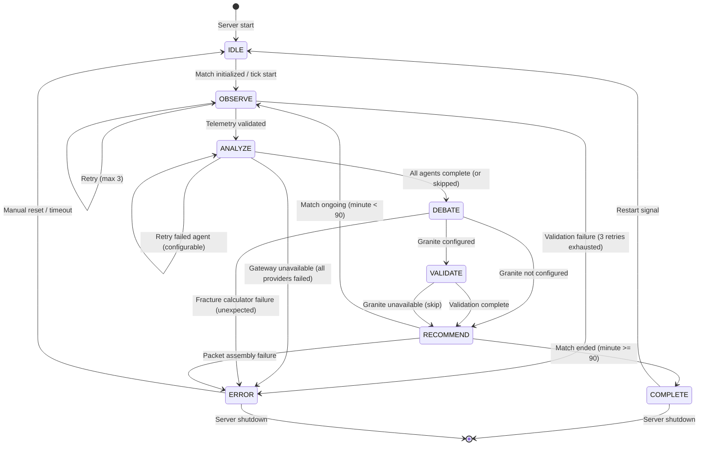

# State Machine Architecture Design — Kronos Swarm Core

**Status:** Design Document (not implemented)
**Target:** `backend/orchestrator/state_machine.py` (currently empty)
**Design Date:** 2026-06-20

---

## 1. Current Architecture (Baseline)

### Existing orchestration flow (`core_supervisor.py`):

```
process_next_tick()
  ├─ KronosMatchTicker.generate_tick()       → KronosTelemetryPacket
  ├─ For each of 5 agents:
  │    ├─ agent.construct_prompt(packet)      → prompt string
  │    └─ LLMGateway.generate(name, prompt)   → LLMResponse
  ├─ SwarmFractureCalculator.calculate()      → SwarmFractureMetrics
  └─ Return dict { telemetry, debate_outputs, swarm_metrics, provider_metadata }
```

### Current SSE packet shape (`app_server.py`):

```json
{
  "telemetry": { "minute": 1, "score_home": 0, "score_away": 0, ... },
  "fracture_index": 0.0,
  "chaos_probability": 0.0,
  "debate_outputs": { "pragmatist": "...", "mood_ring": "...", ... }
}
```

### Current frontend consumption (`KronosProvider.tsx`):

```typescript
// normalizeKronosPacket() accepts:
interface KronosPacket {
  telemetry?: Telemetry;
  swarm_metrics?: SwarmMetrics;
  debate_outputs?: DebateOutputs;
  minute?: number;
  fracture_index?: number;
  chaos_probability?: number;
}
```

**Constraint:** The frontend `normalizeKronosPacket` uses optional chaining (`??`) on every field. Any additional fields added to the SSE payload will be ignored by the existing normalizer, **not** cause errors. This means the SSE packet can be extended without breaking the current frontend.

---

## 2. Target Architecture

```
                  ┌──────────────────────────────────────┐
                  │         KRONOS STATE MACHINE          │
                  │                                      │
     Ticker ─────►│ 1. OBSERVE                           │
     Packet       │    collect telemetry                  │
                  │    detect anomalies                   │
                  └──────────┬───────────────────────────┘
                             │ validated telemetry
                             ▼
                  ┌──────────────────────────────────────┐
                  │ 2. ANALYZE                            │
                  │    execute specialist agents           │
                  │    produce structured assessments      │
                  └──────────┬───────────────────────────┘
                             │ agent assessments
                             ▼
                  ┌──────────────────────────────────────┐
                  │ 3. DEBATE                             │
                  │    compare agent outputs              │
                  │    identify agreements/contradictions │
                  │    calculate fracture metrics         │
                  └──────────┬───────────────────────────┘
                             │ debate output + fracture
                             ▼
                  ┌──────────────────────────────────────┐
                  │ 4. VALIDATE [future Granite]          │
                  │    confidence scoring                 │
                  │    evidence verification               │
                  └──────────┬───────────────────────────┘
                             │ validated recommendation
                             ▼
                  ┌──────────────────────────────────────┐
                  │ 5. RECOMMEND                          │
                  │    generate final recommendation      │
                  │    determine urgency                  │
                  └──────────┬───────────────────────────┘
                             │ final packet
                             ▼
                  ┌──────────────────────────────────────┐
                  │         SSE ASSEMBLY                  │
                  │    flatten for frontend compatibility │
                  │    push to /stream                    │
                  └──────────────────────────────────────┘
```

---

## 3. State Definitions

### Enum: `KronosPhase`

```python
class KronosPhase(Enum):
    IDLE       = "IDLE"        # Waiting for match start
    OBSERVE    = "OBSERVE"     # Collecting telemetry
    ANALYZE    = "ANALYZE"     # Agent execution
    DEBATE     = "DEBATE"      # Fracture calculation
    VALIDATE   = "VALIDATE"    # Confidence scoring (future)
    RECOMMEND  = "RECOMMEND"   # Final recommendation
    COMPLETE   = "COMPLETE"    # Match ended / summary
    ERROR      = "ERROR"       # Irrecoverable failure
```

### State: `IDLE`

| Property | Value |
|---|---|
| **Entry condition** | Server starts, match not initialized |
| **Activity** | Wait for match configuration or auto-start signal |
| **Exit condition** | Match ticker initialized → `OBSERVE` |
| **Failure state** | Configuration missing → remain `IDLE`, log warning |
| **Current-equivalent** | Not represented in today's code |

### State: `OBSERVE`

| Property | Value |
|---|---|
| **Entry condition** | Tick timer fires, match active |
| **Activity** | Call `KronosMatchTicker.generate_tick()`, validate packet integrity, detect anomalous metric values, attach match context (phase, weather, minute bucket) |
| **Output** | `ObserveOutput` — validated telemetry + context + anomaly flags |
| **Exit condition** | Telemetry validated → `ANALYZE`; validation failure → retry or `ERROR` |
| **Failure state** | Telemetry packet malformed → retry same tick (max 3), then skip to `COMPLETE` |
| **Current-equivalent** | Inline in `process_next_tick()` — ticker call is the first step |

### State: `ANALYZE`

| Property | Value |
|---|---|
| **Entry condition** | Validated telemetry available |
| **Activity** | For each registered agent: call `agent.construct_prompt(packet)`, call `LLMGateway.generate(agent_name, prompt)`, collect structured assessments, run agents in parallel (future Band) |
| **Output** | `AnalyzeOutput` — dict of agent name → `AgentAssessment` (verdict + confidence + metadata) |
| **Exit condition** | All agents complete → `DEBATE`; agent failure → retry or skip failed agent |
| **Failure state** | LLM timeout/unavailable → mark agent as `UNAVAILABLE`, continue with remaining agents |
| **Current-equivalent** | Inline in `process_next_tick()` — agent loop is the second step |

### State: `DEBATE`

| Property | Value |
|---|---|
| **Entry condition** | All agent assessments collected |
| **Activity** | Run `SwarmFractureCalculator.calculate()`, classify agent outputs, compute agreement/fracture/chaos, identify contradictions, log dissenting positions |
| **Output** | `DebateOutput` — `SwarmFractureMetrics` + contradiction map + consensus classification |
| **Exit condition** | Fracture computed → `VALIDATE` (or → `RECOMMEND` if Granite not configured) |
| **Failure state** | Empty agent set → safe default metrics, proceed |
| **Current-equivalent** | Inline in `process_next_tick()` — fracture calculator is the third step |

### State: `VALIDATE` *(Future — Granite Integration)*

| Property | Value |
|---|---|
| **Entry condition** | Debate completed, Granite provider configured |
| **Activity** | Send debate summary + telemetry to Granite validation model, receive confidence scores and evidence verification, cross-check agent claims against telemetry |
| **Output** | `ValidateOutput` — confidence score per agent, overall trust level, evidence flags, validation warnings |
| **Exit condition** | Validation complete → `RECOMMEND`; Granite unavailable → skip to `RECOMMEND` |
| **Failure state** | Granite API failure → log warning, proceed without validation |
| **Current-equivalent** | Not implemented |

### State: `RECOMMEND`

| Property | Value |
|---|---|
| **Entry condition** | Validation complete (or skipped) |
| **Activity** | Merge fracture metrics + validation scores → final recommendation, determine urgency level (STABLE/WATCH/CRITICAL), select supporting evidence, format SSE packet payload |
| **Output** | `RecommendOutput` — final packet (telemetry + metrics + debate + recommendation) |
| **Exit condition** | Packet assembled → push to SSE → if match ongoing, return to `OBSERVE`; if match ended, → `COMPLETE` |
| **Failure state** | Packet assembly error → retry once → `ERROR` |
| **Current-equivalent** | The dict construction in `process_next_tick()` return is partially a RECOMMEND step, but the lead coach verdict is computed on the frontend, not the backend |

### State: `COMPLETE`

| Property | Value |
|---|---|
| **Entry condition** | Match ended or error threshold exceeded |
| **Activity** | Emit final match summary, clean up ticker, await restart signal |
| **Output** | `CompleteOutput` — match summary statistics |
| **Exit condition** | Restart signal → reset ticker → `IDLE`; no restart → remain `COMPLETE` |
| **Current-equivalent** | Not implemented — ticker runs past 90 indefinitely |

### State: `ERROR`

| Property | Value |
|---|---|
| **Entry condition** | Irrecoverable error in any state |
| **Activity** | Log error, emit error event on SSE, halt processing |
| **Output** | `ErrorOutput` — error code, message, failed state |
| **Exit condition** | Manual reset or timeout → `IDLE`; no recovery → remain `ERROR` |
| **Current-equivalent** | Not implemented — `BrokenPipeError` in SSE handler is the only error handling |

---

## 4. Transition Rules

### Diagram (Mermaid)



### Transition Conditions Table

| From | To | Condition | Notes |
|---|---|---|---|
| `IDLE` | `OBSERVE` | `match_initialized == True` | Auto-start on first tick or explicit start signal |
| `OBSERVE` | `ANALYZE` | `telemetry_validated == True` | Always succeeds with current ticker (synthetic data) |
| `OBSERVE` | `OBSERVE` | `telemetry_validated == False AND retries < 3` | For future real-data ingestion validation |
| `OBSERVE` | `ERROR` | `telemetry_validated == False AND retries >= 3` | Irrecoverable data source failure |
| `ANALYZE` | `DEBATE` | `all agents processed OR timeout` | Failed agents are marked `UNAVAILABLE`, not blocking |
| `ANALYZE` | `ANALYZE` | `agent failed AND retry < max_retries` | Per-agent retry for transient LLM failures |
| `ANALYZE` | `ERROR` | `gateway unavailable AND no agents responded` | Total provider failure |
| `DEBATE` | `VALIDATE` | `granite_configured == True` | Gated by env/config |
| `DEBATE` | `RECOMMEND` | `granite_configured == False` | Current behavior |
| `DEBATE` | `ERROR` | `unexpected exception in calculator` | Catches division-by-zero etc. |
| `VALIDATE` | `RECOMMEND` | `validation_complete OR validation_skipped` | Non-blocking — validation is advisory |
| `RECOMMEND` | `OBSERVE` | `match_minute < 90` | Normal tick cycle continues |
| `RECOMMEND` | `COMPLETE` | `match_minute >= 90 AND match_not_restarted` | Match lifecycle complete |
| `RECOMMEND` | `ERROR` | `packet_assembly_failed` | Structural error in output formatting |
| `COMPLETE` | `IDLE` | `restart_signal == True` | User- or timer-initiated restart |
| `ERROR` | `IDLE` | `reset_signal == True` | Admin recovery action |

---

## 5. Data Models

### `KronosPhase` Enum

```python
from enum import Enum, auto

class KronosPhase(Enum):
    IDLE = auto()
    OBSERVE = auto()
    ANALYZE = auto()
    DEBATE = auto()
    VALIDATE = auto()
    RECOMMEND = auto()
    COMPLETE = auto()
    ERROR = auto()
```

### Core State Dataclass (Immutable per tick)

```python
from __future__ import annotations

from dataclasses import dataclass, field
from enum import Enum, auto
from typing import Dict, List, Optional, Any

from backend.contracts.telemetry_dataclasses import KronosTelemetryPacket
from backend.contracts.swarm_metrics import SwarmFractureMetrics


# ── Agent-level models ──────────────────────────────────────────────

class AgentStatus(Enum):
    PENDING = auto()
    RUNNING = auto()
    COMPLETED = auto()
    FAILED = auto()
    UNAVAILABLE = auto()
    SKIPPED = auto()


@dataclass(frozen=True)
class AgentAssessment:
    """Structured output from a single agent after ANALYZE phase."""
    agent_key: str                                 # e.g. "pragmatist"
    agent_name: str                                # e.g. "Market Pragmatist"
    status: AgentStatus
    verdict: str                                   # Raw LLM response text
    provider: str                                  # "mock", "bob", "granite", etc.
    prompt: str                                    # The prompt that was sent
    confidence: Optional[float] = None             # Future: validation score
    error: Optional[str] = None                    # Error message if failed


# ── Phase output models (immutable per tick) ────────────────────────

@dataclass(frozen=True)
class ObserveOutput:
    """Output of the OBSERVE phase."""
    telemetry: KronosTelemetryPacket
    match_minute: int
    match_phase: str                               # "GRIND" | "WEATHER" | "CHAOS"
    anomalies: List[str] = field(default_factory=list)
    warnings: List[str] = field(default_factory=list)


@dataclass(frozen=True)
class AnalyzeOutput:
    """Output of the ANALYZE phase."""
    assessments: Dict[str, AgentAssessment]
    all_succeeded: bool
    failed_agents: List[str] = field(default_factory=list)
    skipped_agents: List[str] = field(default_factory=list)


@dataclass(frozen=True)
class DebateOutput:
    """Output of the DEBATE phase."""
    fracture_metrics: SwarmFractureMetrics
    contradictions: List[str] = field(default_factory=list)  # Agent pairs that disagree
    high_risk_agents: List[str] = field(default_factory=list)
    consensus_reached: bool


@dataclass(frozen=True)
class ValidateOutput:
    """Output of the VALIDATE phase (future Granite)."""
    confidence_scores: Dict[str, float] = field(default_factory=dict)  # agent_key → score
    overall_confidence: float = 0.0
    evidence_flags: List[str] = field(default_factory=list)
    validation_errors: List[str] = field(default_factory=list)
    skipped: bool = True                             # True when Granite not configured


@dataclass(frozen=True)
class RecommendOutput:
    """Output of the RECOMMEND phase — the final tick payload."""
    telemetry: KronosTelemetryPacket
    fracture_metrics: SwarmFractureMetrics
    assessments: Dict[str, AgentAssessment] = field(default_factory=dict)
    validation: Optional[ValidateOutput] = None
    recommendation: str = ""                         # Final text recommendation
    urgency: str = "STABLE"                          # "STABLE" | "WATCH" | "CRITICAL"
    supporting_evidence: List[str] = field(default_factory=list)


@dataclass(frozen=True)
class ErrorOutput:
    """Output when the state machine enters ERROR."""
    failed_phase: KronosPhase
    error_code: str
    error_message: str
    recoverable: bool = False
    telemetry: Optional[KronosTelemetryPacket] = None


# ── Match lifecycle ─────────────────────────────────────────────────

@dataclass(frozen=True)
class CompleteOutput:
    """Output when match reaches COMPLETE state."""
    total_minutes: int
    final_score: tuple[int, int]
    tick_count: int
    summary: Dict[str, Any] = field(default_factory=dict)


# ── Consolidated tick result (what the orchestrator returns) ────────

@dataclass(frozen=True)
class TickResult:
    """Immutable result of one full state-machine cycle."""
    phase: KronosPhase
    observe: Optional[ObserveOutput] = None
    analyze: Optional[AnalyzeOutput] = None
    debate: Optional[DebateOutput] = None
    validate: Optional[ValidateOutput] = None
    recommend: Optional[RecommendOutput] = None
    complete: Optional[CompleteOutput] = None
    error: Optional[ErrorOutput] = None
```

### SSE Packet Shape (Backward Compatible)

The SSE JSON payload must retain all existing fields and add new ones as **optional additions**:

```json
{
  "telemetry": { "minute": 1, "score_home": 0, "score_away": 0, ... },
  "fracture_index": 0.0,
  "chaos_probability": 0.0,
  "debate_outputs": { "pragmatist": "...", ... },

  "state_machine": {
    "phase": "RECOMMEND",
    "tick": 42,
    "duration_ms": 145
  },

  "anomalies": [],
  "warnings": [],

  "recommendation": {
    "urgency": "STABLE",
    "text": "",
    "supporting_evidence": []
  },

  "agent_assessments": {
    "pragmatist": { "status": "COMPLETED", "provider": "mock", "confidence": null },
    "mood_ring": { "status": "COMPLETED", "provider": "mock", "confidence": null },
    "gambler": { "status": "COMPLETED", "provider": "mock", "confidence": null },
    "judge": { "status": "COMPLETED", "provider": "mock", "confidence": null },
    "anarchist": { "status": "COMPLETED", "provider": "mock", "confidence": null }
  }
}
```

**Backward compatibility verification:**
- `telemetry`, `fracture_index`, `chaos_probability`, `debate_outputs` — unchanged, at top level
- `normalizeKronosPacket()` uses `??` on every field it reads — new fields are ignored
- Existing frontend `KronosState` and components continue to work without modification
- New fields are consumed only by updated or new frontend components

---

## 6. Interfaces

### `KronosStateMachine`

```python
class KronosStateMachine:
    """Drives a single tick through the OBSERVE→ANALYZE→DEBATE→VALIDATE→RECOMMEND pipeline.

    One instance per match. Thread-safe state transitions via immutable outputs.
    """

    current_phase: KronosPhase
    tick_count: int
    match_active: bool

    def transition(self, input_data: Any) -> TickResult:
        """Execute one tick: compute the next state based on current phase + input.
        Returns an immutable TickResult describing the completed transition.
        """
        ...

    def reset(self) -> None:
        """Reset the state machine for a new match."""
        ...

    def get_current_state(self) -> KronosPhase:
        """Return the current phase without side effects."""
        ...

    def is_terminal(self) -> bool:
        """Return True if in COMPLETE or ERROR (non-recoverable)."""
        ...
```

### State Handlers (Strategy Pattern)

```python
from abc import ABC, abstractmethod

class StateHandler(ABC):
    """Interface for a single state's execution logic."""

    @abstractmethod
    def execute(self, context: KronosStateMachine, data: Any) -> TickResult:
        """Execute the state's logic and return the result + next phase."""
        ...


class ObserveHandler(StateHandler):
    def execute(self, context: KronosStateMachine, data: Any) -> TickResult:
        # Call ticker, validate, detect anomalies → return ObserveOutput
        ...

class AnalyzeHandler(StateHandler):
    def execute(self, context: KronosStateMachine, data: Any) -> TickResult:
        # Run agents via LLMGateway → return AnalyzeOutput
        ...

class DebateHandler(StateHandler):
    def execute(self, context: KronosStateMachine, data: Any) -> TickResult:
        # Calculate fracture, find contradictions → return DebateOutput
        ...

class ValidateHandler(StateHandler):
    def execute(self, context: KronosStateMachine, data: Any) -> TickResult:
        # Future Granite validation → return ValidateOutput
        ...

class RecommendHandler(StateHandler):
    def execute(self, context: KronosStateMachine, data: Any) -> TickResult:
        # Assemble final packet, determine urgency → return RecommendOutput
        ...
```

### Provider Configuration (Extension for Granite)

```python
@dataclass
class ValidationConfig:
    """Configuration for the VALIDATE phase."""
    enabled: bool = False
    provider: str = "granite"           # "granite" | "watsonx" | etc.
    api_url: str = ""
    api_key: Optional[str] = None
    model_id: str = "granite-13b"
    min_confidence: float = 0.6         # Below this: flag for review
```

### Integration with `RuntimeConfig`

```python
# New env vars to add to backend/config/runtime.py:

class RuntimeConfig:
    # ...existing fields...

    # State machine
    self.kronos_max_agent_retries: int = int(os.environ.get("KRONOS_MAX_AGENT_RETRIES", "1"))
    self.kronos_max_observe_retries: int = int(os.environ.get("KRONOS_MAX_OBSERVE_RETRIES", "3"))
    self.kronos_match_duration: int = int(os.environ.get("KRONOS_MATCH_DURATION", "90"))

    # Validation (future Granite)
    self.granite_enabled: bool = os.environ.get("KRONOS_VALIDATION_ENABLED", "false").lower() == "true"
    self.granite_api_url: str = os.environ.get("GRANITE_API_URL", "")
    self.granite_api_key: Optional[str] = os.environ.get("GRANITE_API_KEY")
    self.granite_model_id: str = os.environ.get("GRANITE_MODEL_ID", "granite-13b")
```

---

## 7. Integration with Current Orchestrator

### Migration Path (Backward Compatible)

The current `KronosOrchestrator.process_next_tick()` would be refactored to delegate to the state machine:

```python
class KronosOrchestrator:
    def __init__(self) -> None:
        self.ticker = KronosMatchTicker()
        self.fracture_calculator = SwarmFractureCalculator()
        self.gateway = LLMGateway()
        self.state_machine = KronosStateMachine(
            ticker=self.ticker,
            fracture_calculator=self.fracture_calculator,
            gateway=self.gateway,
        )

    def process_next_tick(self) -> Dict[str, Any]:
        tick_result = self.state_machine.transition(None)

        # Build backward-compatible dict for existing app_server.py
        return {
            "telemetry": asdict(tick_result.observe.telemetry) if tick_result.observe else {},
            "debate_outputs": {
                k: a.verdict
                for k, a in (tick_result.analyze.assessments.items()
                            if tick_result.analyze else {})
            },
            "swarm_metrics": asdict(tick_result.debate.fracture_metrics)
                            if tick_result.debate else {},
            "provider_metadata": {
                k: a.provider
                for k, a in (tick_result.analyze.assessments.items()
                            if tick_result.analyze else {})
            },
            # New: pass through for extended SSE payload
            "state_machine": {
                "phase": tick_result.phase.value,
                "tick": self.state_machine.tick_count,
            },
        }
```

### `app_server.py` Changes (Conceptual)

The SSE assembly in `_handle_stream` and `_handle_minute` would be updated to include new fields from `TickResult` without removing existing fields:

```python
def _handle_stream(self):
    # ... existing SSE setup ...
    while True:
        result = orchestrator.process_next_tick()
        payload = {
            "telemetry": self._build_telemetry(result),
            "fracture_index": result["swarm_metrics"]["fracture_index"],
            "chaos_probability": result["swarm_metrics"]["chaos_probability"],
            "debate_outputs": result["debate_outputs"],

            # New optional fields (frontend ignores if absent)
            "state_machine": result.get("state_machine"),
            "agent_assessments": result.get("agent_assessments"),
            "recommendation": result.get("recommendation"),
            "anomalies": result.get("anomalies", []),
            "warnings": result.get("warnings", []),
        }
        # ... existing SSE write ...
```

### What Changes vs What Stays

| Component | Changes Required |
|---|---|
| `state_machine.py` | **Create** — implement `KronosStateMachine` + all state handlers + data models |
| `core_supervisor.py` | **Refactor** — delegate tick logic to state machine; keep backward-compatible dict output |
| `app_server.py` | **Minor** — add optional new fields to SSE payload; existing fields untouched |
| `kronos_ticker.py` | **No change** — remains the data source for OBSERVE phase |
| `archetypes.py` | **No change** — agents remain prompt builders; their outputs are wrapped in `AgentAssessment` |
| `gateway.py` | **No change** — still the LLM routing layer; called by ANALYZE handler |
| `mock_provider.py` | **No change** |
| `bob_provider.py` | **No change** |
| `swarm_metrics.py` | **No change** — called by DEBATE handler |
| `telemetry_dataclasses.py` | **No change** |
| `config/runtime.py` | **Extend** — add state machine and validation env vars |
| **Frontend** | **No change required** — all new SSE fields are additive and optional |
| **Tests** | **Add** — new test suite for state machine transitions |

---

## 8. Future Extension Points

### 8.1 Granite Validation Integration

When Granite is configured (env `KRONOS_VALIDATION_ENABLED=true`), the `VALIDATE` handler:

1. Receives `AnalyzeOutput` + raw telemetry
2. Constructs a structured validation prompt containing all agent verdicts and current metrics
3. Calls a Granite provider (new `granite_provider.py` — similar pattern to `BobProvider`)
4. Parses the response into confidence scores per agent
5. Returns `ValidateOutput` with scores + evidence flags

If Granite is not configured, `VALIDATE` immediately returns `ValidateOutput(skipped=True)`.

**Granite provider interface:**

```python
class GraniteProvider:
    def __init__(self, config: ValidationConfig) -> None: ...
    def validate(self, assessments: Dict[str, AgentAssessment],
                 telemetry: KronosTelemetryPacket) -> ValidateOutput: ...
```

### 8.2 Band Orchestration Compatibility

The `ANALYZE` phase handler is designed to support parallel agent execution:

```python
# Current: sequential
for key, agent in agents:
    response = self.gateway.generate(agent.name, prompt)

# Future Band-compatible:
async def analyze_parallel(agents, gateway, telemetry):
    async with band_session() as session:
        tasks = [
            session.run(agent.name, agent.construct_prompt(telemetry))
            for agent in agents
        ]
        results = await asyncio.gather(*tasks, return_exceptions=True)
```

Each `AgentAssessment` already carries `status` (`PENDING`, `RUNNING`, `COMPLETED`, `FAILED`), making it compatible with Band's orchestration model where agents may be distributed across workers.

### 8.3 Multi-Agent Expansion

The `assessments: Dict[str, AgentAssessment]` model supports arbitrary agent counts. Adding a new agent requires:

1. Create a new `BaseSwarmAgent` subclass (existing pattern)
2. Register it in `KronosStateMachine.agent_registry`

No state machine structural changes needed.

### 8.4 Match Restart / Multi-Match Support

The `COMPLETE → IDLE` transition enables match replay. A `KronosSession` wrapper could manage multiple matches:

```python
class KronosSession:
    def start_match(self) -> KronosStateMachine:
        machine = KronosStateMachine(...)
        return machine

    def end_match(self, machine: KronosStateMachine) -> CompleteOutput:
        machine.reset()
        return machine.transition(None)  # returns COMPLETE output
```

---

## 9. Error & Retry Strategy

| Scenario | Handling |
|---|---|
| **Telemetry validation failure** | Retry OBSERVE up to `KRONOS_MAX_OBSERVE_RETRIES` (default 3). Exhausted → ERROR. |
| **Agent LLM timeout** | Retry failed agent up to `KRONOS_MAX_AGENT_RETRIES` (default 1). Mark as `FAILED` if exhausted; continue with remaining agents. |
| **All agents failed** | ANALYZE transitions to ERROR — no data for debate. |
| **Fracture calculator exception** | DEBATE catches exception, logs, transitions to ERROR. |
| **Granite API failure** | VALIDATE logs warning, returns `skipped=True`, transitions to RECOMMEND. Non-blocking. |
| **SSE write failure** | Handled in `app_server.py` (existing `BrokenPipeError` catch). State machine is unaware of transport. |
| **Unexpected exception in handler** | Caught by state machine wrapper, transitions to ERROR with error details. |

---

## 10. Testing Strategy (Conceptual)

| Test Category | What to Test |
|---|---|
| **State transitions** | Every `(from_state, condition) → to_state` pair in the transition table |
| **Immutable outputs** | `TickResult` and all phase outputs cannot be mutated after creation |
| **Backward compatibility** | Dict output from `process_next_tick()` contains all keys the frontend expects |
| **Agent failure modes** | N agents fail → machine continues with remaining agents |
| **All agents fail** | Machine enters ERROR |
| **Granite skip** | `KRONOS_VALIDATION_ENABLED=false` → VALIDATE sets `skipped=True`, no network call |
| **Complete lifecycle** | Tick 1→90 transitions through all states, ends at COMPLETE |
| **Reset** | COMPLETE → IDLE → OBSERVE: second match produces clean state |
| **Concurrent safety** | (Future) State machine handles parallel agent execution correctly |
| **Config-driven behavior** | Different `KRONOS_LLM_MODE` values produce correct transitions |

---

## 11. File Manifest

| File | Action | Purpose |
|---|---|---|
| `backend/orchestrator/state_machine.py` | **Create** | `KronosStateMachine` class, `KronosPhase` enum, `StateHandler` interface, all 7 handler implementations |
| `backend/orchestrator/core_supervisor.py` | **Refactor** | Delegate `process_next_tick()` to state machine; keep backward-compatible dict output |
| `backend/app_server.py` | **Extend** | Add optional new fields to SSE payload |
| `backend/config/runtime.py` | **Extend** | Add state machine config env vars (retries, match duration, validation) |
| `backend/contracts/state_machine_dataclasses.py` | **Create** | All data models: `AgentAssessment`, `ObserveOutput`, `AnalyzeOutput`, `DebateOutput`, `ValidateOutput`, `RecommendOutput`, `TickResult`, `ErrorOutput`, `CompleteOutput` |
| `backend/tests/test_state_machine.py` | **Create** | Transition tests, failure mode tests, lifecycle tests |
| `backend/tests/test_sss_payload.py` | **Create** | Backward compatibility tests for SSE packet shape |
| **Frontend** | **No change** | All new SSE fields are optional; existing normalizer uses `??` |

---

## 12. Design Decisions

| Decision | Rationale |
|---|---|
| **Immutable dataclasses** for all phase outputs | Prevents accidental mutation across state transitions; simplifies testing; thread-safety foundation |
| **Strategy pattern** for state handlers | Each state's logic is isolated; new states can be added without modifying existing handlers |
| **Backward-compatible SSE payload** | Existing frontend continues to work without any changes; new fields are additive |
| **VALIDATE is non-blocking** | Granite is a future concern; the pipeline must work without it today |
| **Agent parallelization deferred** | Current LLMGateway is sync; parallel execution via Band is a future concern — the `AgentAssessment` model supports it |
| **ERROR state is distinct from exception** | Exceptions in handlers are caught and translated to `ErrorOutput` with a recoverable flag; the state machine does not throw |
| **Match lifecycle managed via phase** | `COMPLETE` phase handles match-end; `IDLE` handles pre-match; current code has neither |
| **Config via env vars, not runtime** | Consistent with existing `RuntimeConfig` pattern; no runtime configuration UI needed yet |
